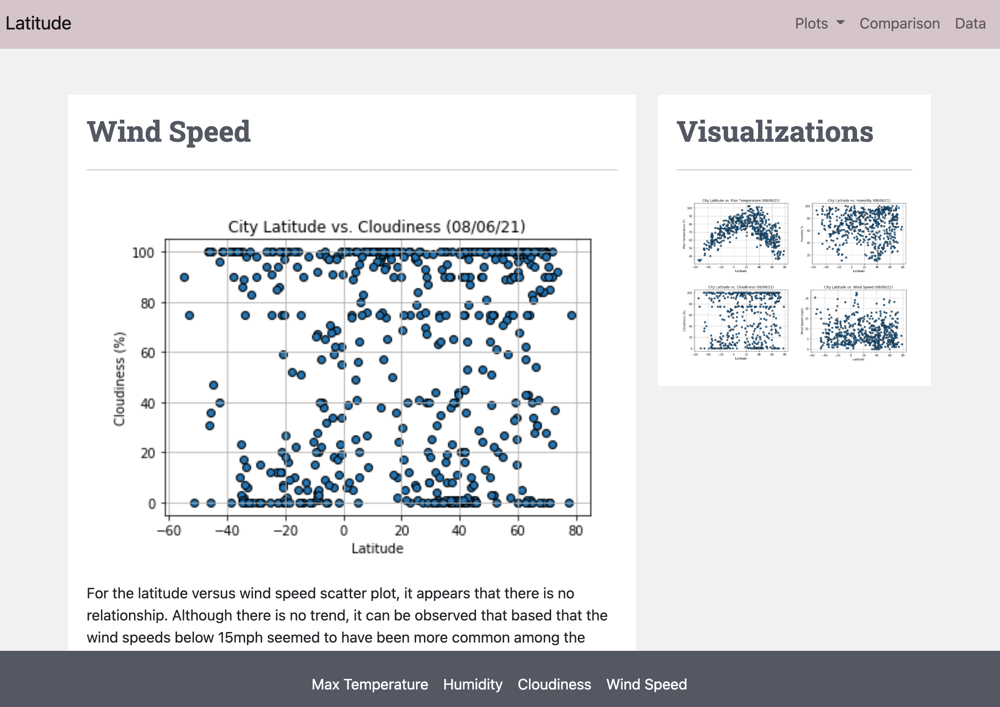
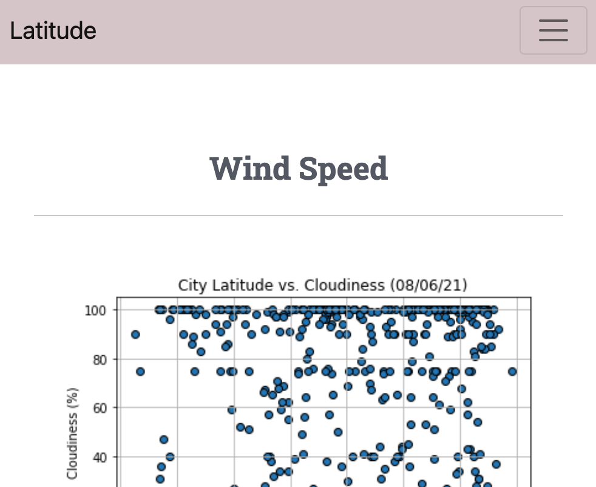

# Web Design Challenge
The website link can be accessed here: [ceci-chapa.github.io/Web-Design-Challenge](https://ceci-chapa.github.io/Web-Design-Challenge/).

For this challenge we were tasked to create a website presentation on the different weather aspects vs. latitude from a dataset of over 500 clients. To create the website we needed to also integrate Bootstrap styles along with our own modifications. Both desktop and mobile would need to function correctly and transition smoothly.

---

### Desktop

Overall, the desktop view would utilize the 12-grid system along with Bootstrap’s help. With Bootsrap’s helpful div classes, implementing the different columns was easily achievable and worked well with different image sizes. The analysis for all pages will be presented on a white container sitting on a grey-like color for the body background.

### Mobile

Once the screen is on mobile, all contents move down to a one column view. With CSS the grey background used for the body in desktop view is then switched to a white background on mobile for a cleaner look. For the data page, the table can be slided to the side to access additional columns.

